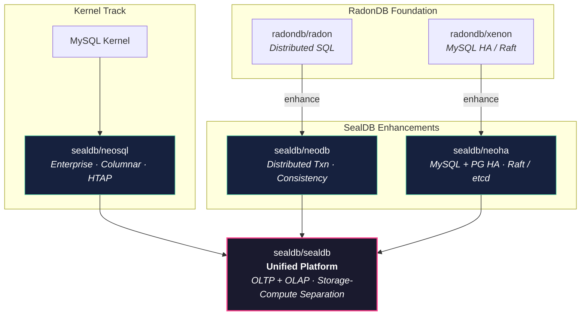

## Hi 👋, I'm Wenshuang Lu (卢文双)

### Senior Database Kernel Engineer · Building Cloud-Native Distributed Databases

---

🔭 **Currently working on** cloud-native MySQL kernel R&D — storage engines, replication, query optimization

🧠 **Background** in Postgres-XC, Greenplum, RadonDB, ClickHouse, and mainstream RDBMS internals (MySQL / PostgreSQL)

📝 **Technical blog** → [dbkernel.com](https://dbkernel.com) · [dbkernel.github.io](https://dbkernel.github.io/)

💬 **Ask me about** database internals → [open an issue](https://github.com/dbkernel/dbkernel/issues)

---

### 🏗 Projects

#### SealDB — Enterprise Database Platform

| Project | Description |
|---------|-------------|
| [sealdb/neosql](https://github.com/sealdb/neosql) | MySQL-kernel-based fork with enterprise features — columnar storage, HTAP |
| [sealdb/neodb](https://github.com/sealdb/neodb) | Enhanced [radon](https://github.com/radondb/radon) with **distributed transactions** and **read/write consistency** |
| [sealdb/metatroni](https://github.com/sealdb/metatroni) | Enhanced [patroni](https://github.com/patroni/patroni) — **MySQL & PostgreSQL HA** |
| [sealdb/neoha](https://github.com/sealdb/neoha) | Enhanced [xenon](https://github.com/radondb/xenon) — **MySQL & PostgreSQL HA**, consensus via **Raft** and **etcd** |
| [sealdb/sealdb](https://github.com/sealdb/sealdb) | SealDB platform — unified OLTP + OLAP, storage-compute separation |

#### RadonDB — Foundation

| Project | Description |
|---------|-------------|
| [radondb/radon](https://github.com/radondb/radon) | Distributed SQL database |
| [radondb/xenon](https://github.com/radondb/xenon) | MySQL high availability with Raft-based replication |

---

### 🏗 Project Evolution

---

### 📚 Latest Writing

- [MySQL 生态现有计算下推方案汇总](https://dbkernel.com) *(2024)*
- [MySQL 测试框架 MTR 系列教程](https://dbkernel.github.io/) *(2023, 4-part series)*
- [业内 MySQL 线程池主流方案详解](https://dbkernel.github.io/) *(MariaDB / Percona / AliSQL / TXSQL)*

📖 [All articles →](https://dbkernel.github.io/)

---

### 🛠 Tech Stack

  
  
  
  
  
  
  
  
  
  
  

---

### 📊 GitHub Stats

  

  

  

  

